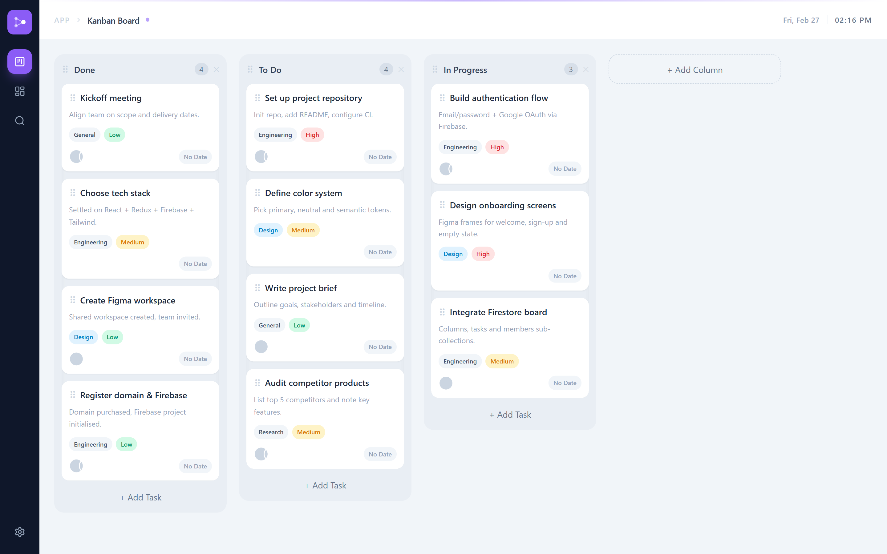

# Kanban Board



A personal kanban board built with React, Redux Toolkit, Firebase, and Tailwind CSS.
This project simulates a production-style task management app with drag-and-drop, real-time Firestore sync, and team collaboration features.

---

## Features

### Board
- Drag-and-drop tasks across columns
- Reorder tasks and columns
- Create, edit, and delete tasks
- Column management (add, rename, delete)
- Task assignees, priority, labels, and due dates
- Pre-seeded board on signup

---

### Dashboard
- Total tasks, high priority, due date, and column stats
- Tasks per column bar chart
- Tasks by priority and label breakdown
- Assignee workload overview

---

### Search
- Live search across all tasks
- Filter by title, description, label, and priority
- Highlighted search matches
- Click result to open task panel

---

### Settings
- Account info and sign out
- Team member management (add, remove, avatar color)
- About section with tech stack info

---

### Global UI
- Responsive layout (mobile + tablet + desktop)
- Bottom tab bar on mobile
- Route-aware header with live clock
- Aesthetic violet / slate design system
- Task side panel with slide-in animation
- Confirm modals for destructive actions

---

## Tech Stack

- React
- Vite (JS + SWC)
- Redux Toolkit
- Firebase Auth
- Firebase Firestore
- Tailwind CSS
- @dnd-kit/core
- Lucide React

---

## Getting Started

### Install dependencies
```bash
npm install
```

### Set up environment variables
Create a `.env` file in the root:
```env
VITE_FIREBASE_API_KEY=your_api_key
VITE_FIREBASE_AUTH_DOMAIN=your_auth_domain
VITE_FIREBASE_PROJECT_ID=your_project_id
VITE_FIREBASE_STORAGE_BUCKET=your_storage_bucket
VITE_FIREBASE_MESSAGING_SENDER_ID=your_messaging_sender_id
VITE_FIREBASE_APP_ID=your_app_id
```

### Run development server
```bash
npm run dev
```

### Build for production
```bash
npm run build
```

### Data Model

All data is stored in Firebase Firestore under each user's UID:

```
users/{uid}/
    columns/{columnId}   → id, title, tasks[], order
    tasks/{taskId}       → id, columnId, title, description, priority, label, assignees[], dueDate
    members/{memberId}   → id, name, avatarColor
```

No shared backend — every user has their own private board.

---

### UI/UX Patterns Demonstrated

- Optimistic UI updates with Firestore sync
- Drag-and-drop with collision detection
- Real-time clock in header
- Slide-in / slide-up panel animations
- Inline field validation with touched state
- Avatar color system with hex colors
- Mobile-first responsive design
- Safe area insets for iOS devices

---

### Purpose

Designed as a portfolio-quality frontend engineering project demonstrating real-world patterns in task management UI, Firebase integration, and modern React architecture.

---

### Future Enhancements

- Due date reminders and notifications
- Task comments and activity log
- Board sharing between users
- Dark mode
- File attachments on tasks
- Pagination for large boards

---

## Contact

Feel free to reach out with any inquiries, opportunities, or collaborations:

- Email: [priyanshusharma0326@gmail.com](mailto:priyanshusharma0326@gmail.com)
- LinkedIn: [Priyanshu Sharma](https://www.linkedin.com/in/priyanshusharma0326)
- Portfolio: [portfolio-xtechilad.vercel.app](https://portfolio-xtechilad.vercel.app/)

---

## Social

Connect with me on social media:

- Twitter: [@xtechilad](https://twitter.com/xtechilad)
- Instagram: [@xtechilad](https://www.instagram.com/xtechilad)
- GitHub: [@priyanshusharma0326](https://github.com/priyanshusharma0326)

Let's engage, share ideas, and stay connected!